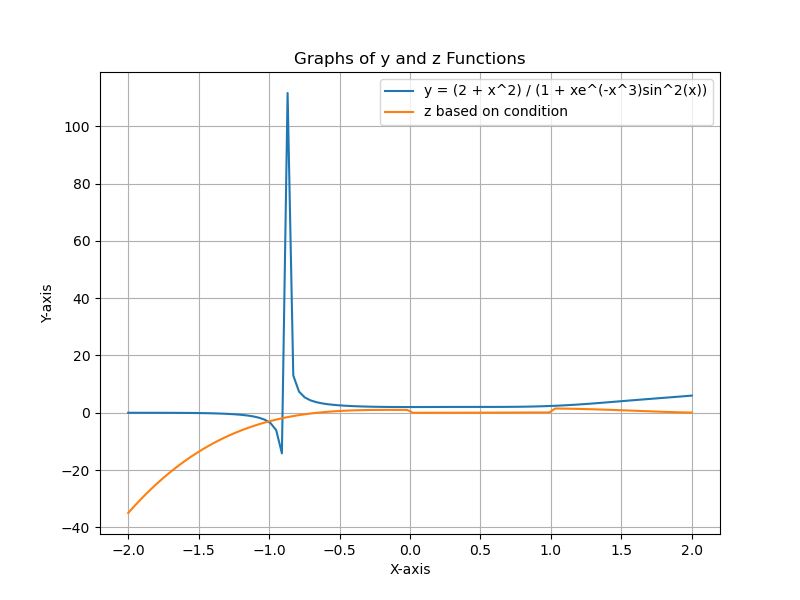
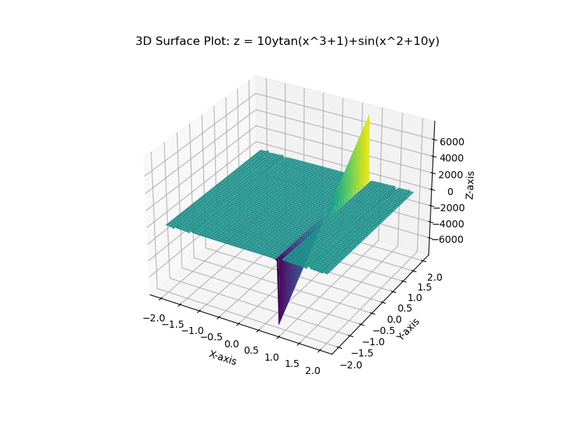
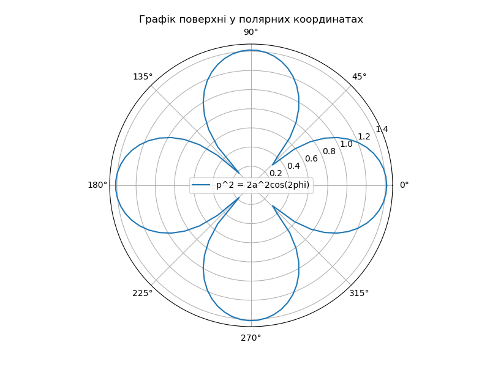
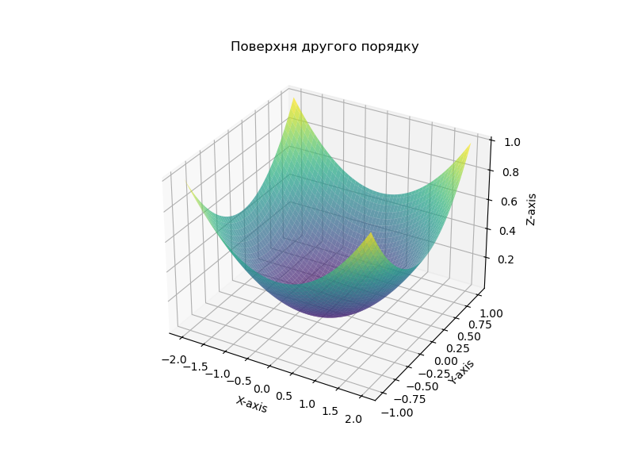
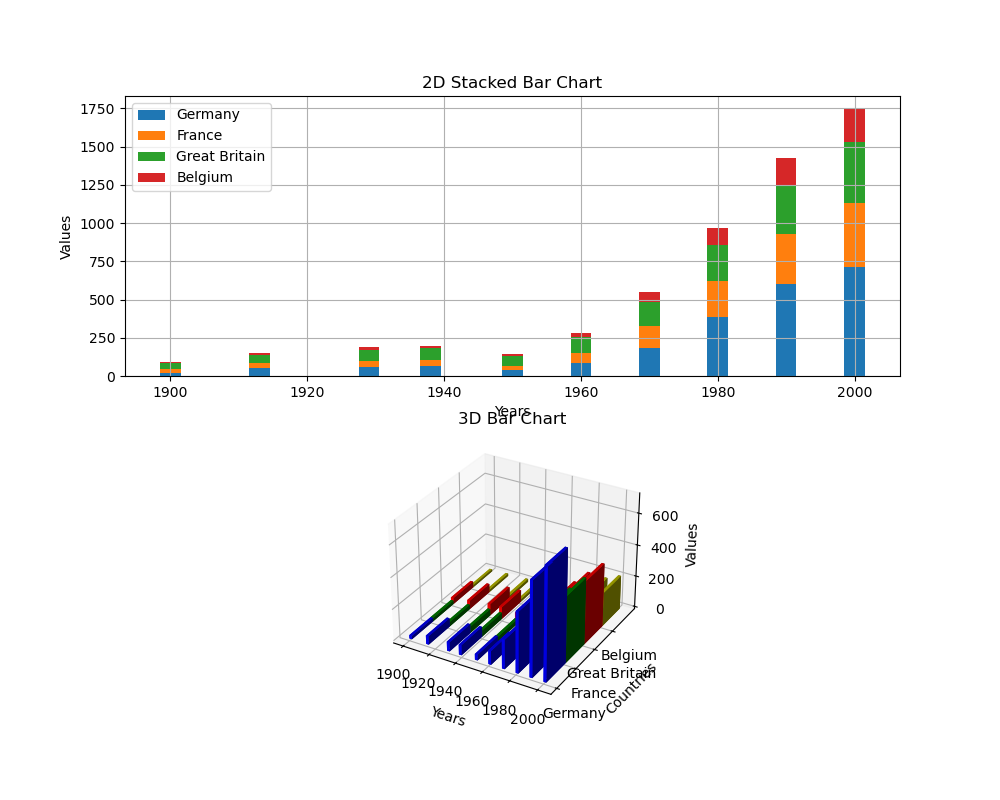

## Lab Report: Task 1
## Davydenko Pavlo IKM-M223b
### Description
In this task, we plotted two functions, \( y \) and \( z \), against the variable \( x \).

### Results
- **Function \( y \)**: \( y = \frac{2 + x^2}{1 + x e^{-x^3} \sin^2(x)} \)
- **Function \( z \)**: Defined conditionally based on \( x \)

### Observations
- The functions \( y \) and \( z \) exhibit distinct behaviors over the range of \( x \).
- \( z \) shows variability due to different conditions based on \( x \).

### Graphs

---

## Lab Report: Task 2

### Description
This task involved creating a 3D surface plot of a function \( z \) in relation to variables \( x \) and \( y \).

### Function
\[ z = 10y \tan(x^3 + 1) + \sin(x^2 + 10y) \]

### Observations
- The plot visualizes how \( z \) changes with varying \( x \) and \( y \).
- Features such as peaks and valleys in the surface plot depict the function's behavior.

### Surface Plot

---

## Lab Report: Task 3

### Description
This task focused on plotting a curve in polar coordinates.

### Function
\[ p^2 = 2a^2 \cos(2\phi) \]

### Observations
- The polar plot demonstrates the relationship between \( p \) and \( \phi \).
- Symmetrical shape due to cosine function characteristics.

### Polar Plot

---

## Lab Report: Task 4

### Description
This task involved plotting a second-order surface in 3D space.

### Function
\[ \frac{X^2}{a^2} + \frac{Y^2}{b^2} = 2c \]

### Observations
- The plot shows the surface defined by the equation.
- Parameters \( a \), \( b \), and \( c \) influence the shape of the surface.

### 3D Surface Plot

---

## Lab Report: Task 5

### Description
In this task, we created stacked bar charts in both 2D and 3D.

### Data
- Countries: Germany, France, Great Britain, Belgium
- Years: 1900, 1913, 1929, 1938, 1950, 1960, 1970, 1980, 1990, 2000

### Observations
- Comparison of values across countries over time.
- Differences in trends and magnitudes visible between countries.

### Charts
- **2D Stacked Bar Chart**
  
- **3D Stacked Bar Chart**
  

---

These reports summarize the tasks conducted in the lab session, providing insights into each plotted graph and the corresponding functions or data analyzed.
