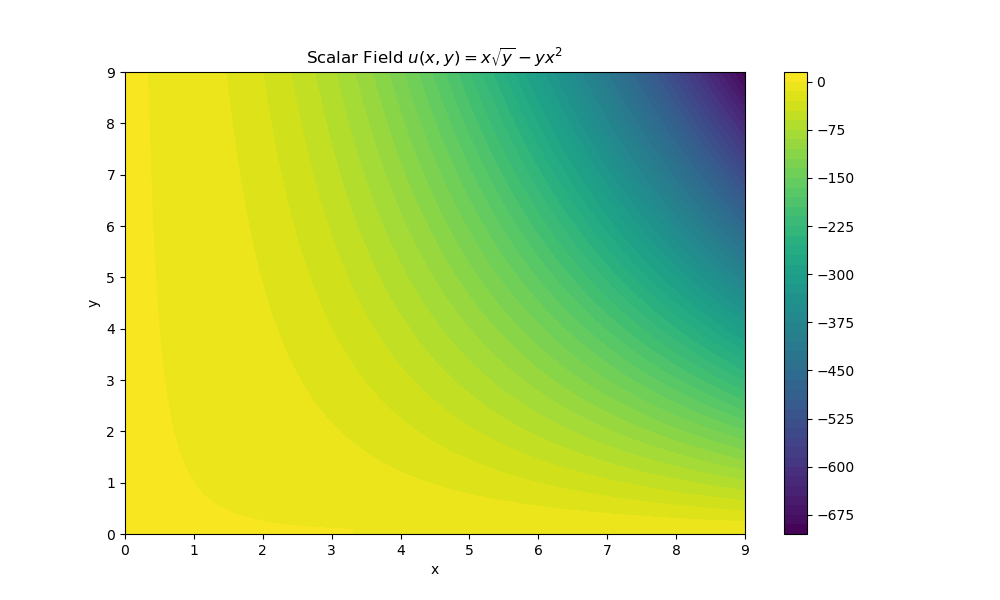
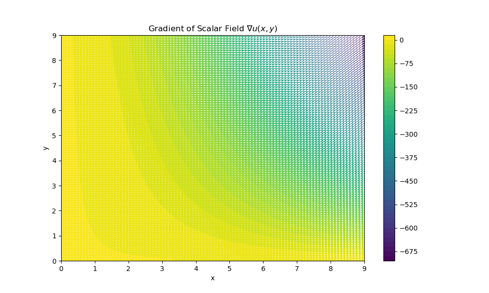
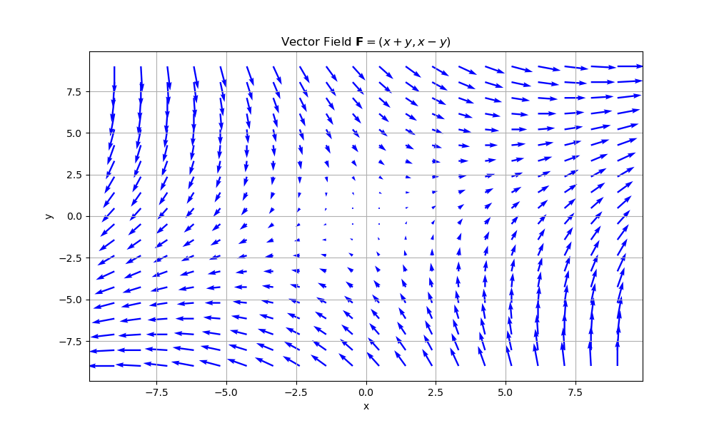
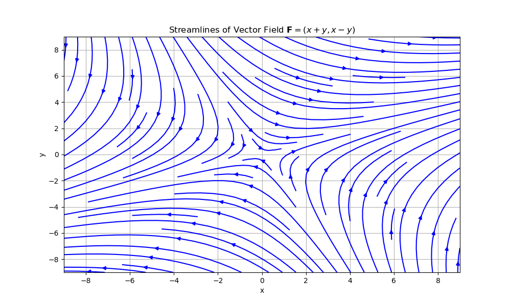
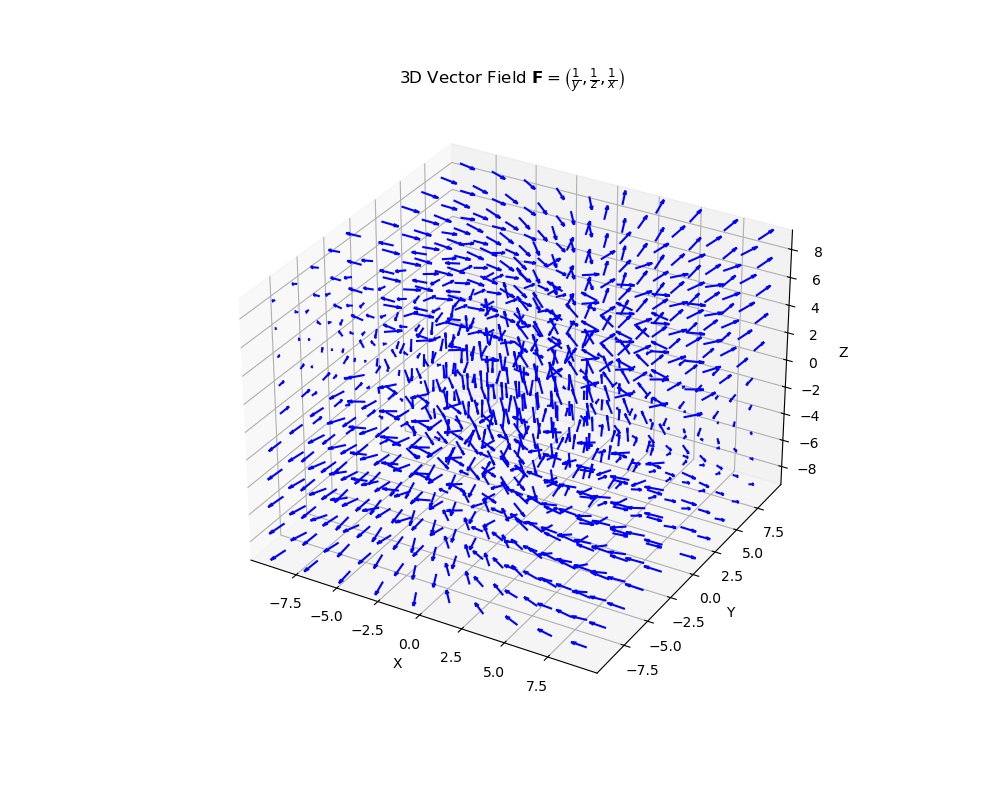
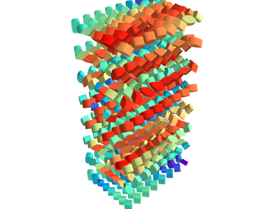

## Lab Report: Task 1

### Description
This task involves visualizing a scalar field \( u(x, y) \) and its gradient \( \nabla u(x, y) \).

### Scalar Field Function
\[ u(x, y) = x \sqrt{y} - y x^2 \]

### Observations
- The contour plot shows the distribution of the scalar field \( u(x, y) \) over the domain.
- The quiver plot displays the gradient \( \nabla u(x, y) \) as a vector field.

### Plots
- **Contour Plot**
  
- **Gradient Vector Field**
  

---

## Lab Report: Task 2

### Description
This task involves visualizing a plane vector field \( \mathbf{F}(x, y) \).

### Vector Field Function
\[ \mathbf{F}(x, y) = (x + y, x - y) \]

### Observations
- The quiver plot shows the vector field \( \mathbf{F}(x, y) \) over the defined domain.
- The streamplot provides a clearer view of the vector field's streamlines.

### Plots
- **Quiver Plot**
  
- **Streamlines Plot**
  

---

## Lab Report: Task 3

### Description
This task involves constructing a three-dimensional visualization of a vector field \( \mathbf{F}(x, y, z) \).

### Vector Field Function
\[ \mathbf{F}(x, y, z) = \left( \frac{1}{y}, \frac{1}{z}, \frac{1}{x} \right) \]

### Observations
- The 3D quiver plot illustrates the vector field \( \mathbf{F}(x, y, z) \) in three dimensions.

### Plot
- **3D Vector Field**
  

---

## Lab Report: Task 4

### Description
This task involves visualizing a tensor field using Mayavi and custom glyph visualization.

### Tensor Field Construction
- The tensor field is constructed with given components and visualized using superquadric glyphs.

### Observations
- Superquadric glyphs depict the tensor field components in 3D space.

### Plot
- **Superquadric Glyph Visualization**
 

---

These reports provide detailed summaries of each lab task, highlighting the functions used, observations made, and visualizations produced in the Python script. Each plot referenced in the reports should be saved separately with appropriate filenames (`task1_contour.png`, `task1_gradient.png`, etc.) based on the tasks performed.
