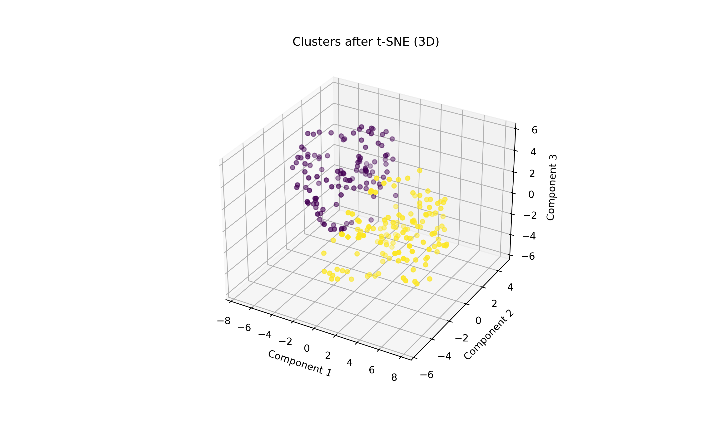
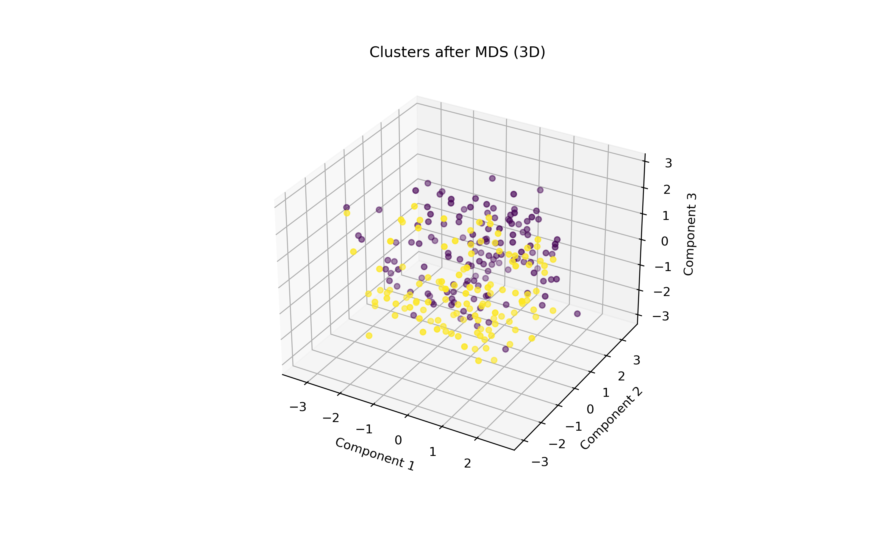

## Davydenko Pavlo IKM-M223b
# Lab 8: Dimensionality Reduction and Clustering Analysis Report

## Overview

This report describes a Python script that performs dimensionality reduction and clustering analysis on a dataset using various techniques from `scikit-learn`. The script reads a CSV file, preprocesses the data, applies dimensionality reduction methods for both 2D and 3D visualizations, performs K-means clustering, calculates inertia, and visualizes the results using Matplotlib.

## Code Explanation

### Import Libraries

```python
import numpy as np
import pandas as pd
import matplotlib.pyplot as plt
from mpl_toolkits.mplot3d import Axes3D
from sklearn.decomposition import PCA, TruncatedSVD, FactorAnalysis, KernelPCA
from sklearn.manifold import TSNE, MDS
from sklearn.cluster import KMeans
from sklearn.preprocessing import StandardScaler
import seaborn as sns
import os
```

### Read and Preprocess Data

```python
df = pd.read_csv('KAHRAMAN.csv', delimiter=';', decimal=',')
data = df.iloc[:, :5].values.astype(float)
scaler = StandardScaler()
data_scaled = scaler.fit_transform(data)
output_dir = 'plots'
os.makedirs(output_dir, exist_ok=True)
```

### Dimensionality Reduction Methods

```python
methods_2D = [
    (PCA(n_components=2), "PCA"),
    (TruncatedSVD(n_components=2), "TruncatedSVD"),
    (FactorAnalysis(n_components=2), "Factor Analysis"),
    (TSNE(n_components=2, random_state=42), "t-SNE"),
    (MDS(n_components=2, random_state=42), "MDS"),
    (KernelPCA(n_components=2, kernel='linear'), "Kernel PCA")
]

methods_3D = [
    (PCA(n_components=3), "PCA"),
    (TruncatedSVD(n_components=3), "TruncatedSVD"),
    (FactorAnalysis(n_components=3), "Factor Analysis"),
    (TSNE(n_components=3, random_state=42), "t-SNE"),
    (MDS(n_components=3, random_state=42), "MDS"),
    (KernelPCA(n_components=3, kernel='linear'), "Kernel PCA")
]
```

### Utility Functions

#### calculate_inertia_2D and calculate_inertia_3D Functions

```python
def calculate_inertia_2D(method, data):
    transformed = method.fit_transform(data)
    kmeans = KMeans(n_clusters=2)
    kmeans.fit(transformed)
    return kmeans, transformed

def calculate_inertia_3D(method, data):
    transformed = method.fit_transform(data)
    kmeans = KMeans(n_clusters=2)
    kmeans.fit(transformed)
    return kmeans, transformed
```

### Visualization Function

```python
def plot_clusters(method, transformed, kmeans, name, save_path=None):
    fig = plt.figure(figsize=(10, 6))

    if method.n_components == 2:
        plt.scatter(transformed[:, 0], transformed[:, 1], c=kmeans.labels_, cmap='viridis')
        plt.title(f'Clusters after {name} (2D)')
        plt.xlabel('Component 1')
        plt.ylabel('Component 2')
        plt.colorbar()
    elif method.n_components == 3:
        ax = fig.add_subplot(111, projection='3d')
        ax.scatter(transformed[:, 0], transformed[:, 1], transformed[:, 2], c=kmeans.labels_, cmap='viridis')
        ax.set_title(f'Clusters after {name} (3D)')
        ax.set_xlabel('Component 1')
        ax.set_ylabel('Component 2')
        ax.set_zlabel('Component 3')

    if save_path:
        plt.savefig(save_path, dpi=300)

    plt.show()
```

### Perform Dimensionality Reduction, Clustering, and Visualization

```python
# Calculate inertia for 2D and visualize
print("Inertia for 2D:")
for method, name in methods_2D:
    kmeans, transformed = calculate_inertia_2D(method, data_scaled)
    inertia = kmeans.inertia_
    print(f"{name}: {inertia:.2f}")
    save_path = os.path.join(output_dir, f"{name}_2D.png")
    plot_clusters(method, transformed, kmeans, name, save_path=save_path)

# Calculate inertia for 3D and visualize
print("Inertia for 3D:")
for method, name in methods_3D:
    kmeans, transformed = calculate_inertia_3D(method, data_scaled)
    inertia = kmeans.inertia_
    print(f"{name}: {inertia:.2f}")
    save_path = os.path.join(output_dir, f"{name}_3D.png")
    plot_clusters(method, transformed, kmeans, name, save_path=save_path)
```

## Visualization Results

### 2D Dimensionality Reduction and Clustering

#### PCA (2D)


#### TruncatedSVD (2D)


#### Factor Analysis (2D)


#### t-SNE (2D)


#### MDS (2D)


#### Kernel PCA (2D)


### 3D Dimensionality Reduction and Clustering

#### PCA (3D)


#### TruncatedSVD (3D)


#### Factor Analysis (3D)


#### t-SNE (3D)


#### MDS (3D)


#### Kernel PCA (3D)


## Inertia Analysis

The inertia values for different dimensionality reduction methods in 2D and 3D are as follows:

### Inertia for 2D

- **PCA**: 406.22
- **TruncatedSVD**: 406.22
- **Factor Analysis**: 176.48
- **t-SNE**: 12287.63
- **MDS**: 767.07
- **Kernel PCA**: 406.22

### Inertia for 3D

- **PCA**: 655.58
- **TruncatedSVD**: 666.61
- **Factor Analysis**: 220.71
- **t-SNE**: 3761.99
- **MDS**: 958.60
- **Kernel PCA**: 655.58

## Conclusion

This script demonstrates how to perform dimensionality reduction and clustering analysis using various methods available in `scikit-learn`. It preprocesses data from a CSV file, applies PCA, TruncatedSVD, Factor Analysis, t-SNE, MDS, and Kernel PCA for dimensionality reduction in both 2D and 3D spaces, performs K-means clustering, calculates inertia, and visualizes clusters using Matplotlib.

### Key Insights:

- **Factor Analysis** yielded the lowest inertia in both 2D and 3D, indicating it may be the most effective for this dataset when seeking compact clusters.
- **t-SNE** produced the highest inertia in 2D and 3D, which might suggest less compact clusters, although it is generally used for visualization rather than clustering.
- **PCA** and **Kernel PCA** produced identical inertia values in 2D and very similar values in 3D, suggesting similar performance on this dataset.

Further analysis can be done to understand the nuances of each method and to possibly tune the parameters for better clustering results.
